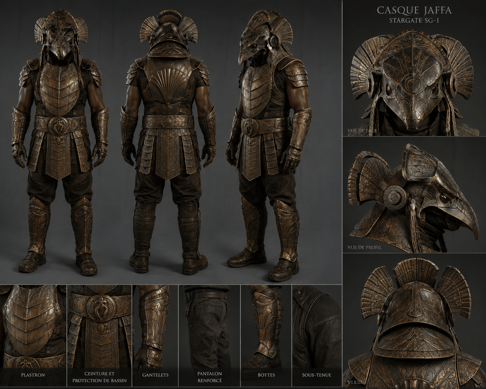
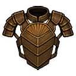
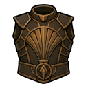
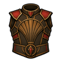
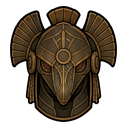
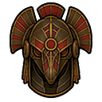
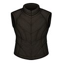
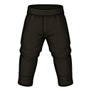
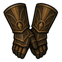
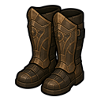

# Armures Jaffa modulaires

> Statut : prototype jouable
> Première version : `0.1.66-dev`
> Gizmo final et contrôle manuel du casque : `0.3.101-dev`
> Visuels non directionnels finalisés : `0.3.102-dev`
## Présentation

Les armures Jaffa sont modulaires. Elles protègent les zones vitales, mais
également les mains, doigts, pieds et orteils qui restent vulnérables dans
RimWorld.

## Pièces disponibles

```text
sous-armure textile Jaffa
pantalon Jaffa
armure Jaffa légère
armure Jaffa lourde
gantelets blindés Jaffa
bottes renforcées Jaffa
ceinture d'armure Jaffa
casque Jaffa rétractable
armure d'officier Jaffa
casque d'officier Jaffa rétractable
```

## Concept art de référence



Ce concept art fixe la direction commune de la tenue : plaques de bronze sombre,
sous-tenue noire, silhouette militaire Jaffa et casque animalier cérémoniel. Il
sert de référence artistique pour les différentes pièces, mais ne représente pas
le rendu porté final dans RimWorld. Les textures directionnelles visibles sur les
pawns restent un travail distinct.

## Icônes au sol et en inventaire

### Armures et casques

| Armure légère | Armure lourde | Armure d'officier |
|---|---|---|
|  |  |  |

| Casque standard déployé | Casque d'officier déployé |
|---|---|
|  |  |

L'ensemble d'officier reprend les formes standard avec des plaques rouges
ciblées, afin de rester immédiatement identifiable sans devenir entièrement
rouge.

### Vêtements et protections complémentaires

| Sous-armure | Pantalon | Ceinture |
|---|---|---|
|  |  |  |

| Gantelets | Bottes |
|---|---|
|  |  |

Ces PNG `128×128` sont les références validées pour l'objet au sol et
l'inventaire. Les gantelets, bottes et la ceinture utilisent un
`drawSize = 0.75` pour conserver une échelle cohérente en jeu.

## Protection localisée

| Pièce | Zones protégées |
|---|---|
| Armure légère | torse, cou, épaules |
| Armure lourde | torse, cou, épaules |
| Armure d'officier | torse, cou, épaules ; `+10 %` d'impact social |
| Gantelets | bras, mains, doigts |
| Bottes | jambes, pieds, orteils |
| Casque déployé | tête complète et visage |

Les gantelets et les bottes sont de véritables équipements défensifs, pas de
simples éléments visuels.

## Casque Jaffa

Depuis `0.3.101-dev`, le casque utilise une bascule manuelle à deux actions :

- `Déployer casque` lorsqu'il est rétracté ;
- `Rétracter casque` lorsqu'il est déployé.

L'enrôlement ne commande plus automatiquement la position. Consulte
[Casque Jaffa rétractable](Jaffa-Retractable-Helmet) pour le gizmo final, la
persistance et la migration des anciennes sauvegardes.

La position modifie sa couverture réelle :

| Position | Couverture |
|---|---|
| Rétracté | sommet de la tête |
| Déployé | tête complète et visage |

Les valeurs brutes d'armure restent identiques. La différence défensive vient
des zones corporelles effectivement couvertes.

## Fabrication

Les armures, casques, gantelets, bottes et ceinture sont produits au banc
approprié après la recherche `Armures Jaffa`. La sous-armure et le pantalon
utilisent les bancs de couture. Les coûts et prérequis de Fabrication augmentent
avec le niveau de protection.
## Équipement des Jaffa générés

Les guerriers et gardes Jaffa Goa'uld reçoivent automatiquement des ensembles
adaptés à leur rôle. Pour l'officier de l'opération Tok'ra, la révision finale
`0.3.74-dev-r2` vérifie l'équipement après génération et ajoute explicitement
l'armure et le casque rouges si nécessaire. Ces pièces restent à commonalité
nulle et ne sont donc pas distribuées au hasard aux autres Jaffa. Les armures
standard restent utilisées dans les raids, colonies et missions du mod. Le
loadout distinctif est validé et publié sous `v0.3.74-dev`.

Consulte [Équipements automatiques des Jaffa Goa'uld](Jaffa-Armor-Loadouts).

## Limites actuelles

Les icônes au sol et en inventaire présentées sur cette page sont finalisées
depuis `0.3.102-dev`. Les textures portées directionnelles des armures, casques
et de la sous-armure restent provisoires.

L'intégration automatique de la sous-armure, du pantalon et de la ceinture aux
Jaffa générés dans le monde et dans les missions est différée. Le système de
casques déployés et rétractés sera également refactorisé plus tard sans casser
les sauvegardes ni mélanger les variantes standard et officier.