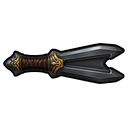

# Couteau Jaffa

> Statut : contenu jouable
> Version : `0.3.103-dev`



## Présentation

Le couteau Jaffa est une lame de combat compacte à pointe fourchue. Il constitue
la première arme de mêlée propre à l'arsenal Jaffa de GateRim SG-1 et complète
le bâton Ma'Tok et le Zat'nik'tel sans les remplacer systématiquement.

La texture finale utilise un PNG transparent `128×128` avec un contour sombre
renforcé. Sa taille au sol et lorsqu'il est équipé est contrôlée par :

```text
drawSize = 0.65
```

## Profil de combat

Le couteau reprend les équivalences du glaive vanilla :

| Propriété | Valeur |
|---|---:|
| Masse | `0,85 kg` |
| Manche contondant | `9` |
| Pointe perforante | `16` |
| Tranchant | `16` |
| Récupération de chaque attaque | `2 s` |
| Travail de fabrication | `12000` ticks |

## Fabrication

La fabrication locale exige :

- la recherche **Armement Jaffa** ;
- un banc d'usinage ;
- Fabrication `4` ;
- `30` unités d'acier ;
- `5` unités de plastacier.

Un couteau récupéré ou acheté reste utilisable avant la fin de la recherche.

## Commerce

Les convois de ravitaillement des clans Jaffa libres peuvent proposer de `0` à
`2` couteaux. L'objet peut également être revendu comme équipement militaire.

## Équipement des troupes Jaffa

Le couteau est ajouté aux sélections d'armes principales :

- guerriers Jaffa Goa'uld : Ma'Tok ou couteau ;
- gardes et officiers Jaffa Goa'uld : Ma'Tok, Zat'nik'tel ou couteau ;
- guerriers, gardes et marchands Jaffa libres : Ma'Tok ou couteau.

Les profils de colonies, raids, caravanes et missions qui héritent de ces
PawnKinds bénéficient automatiquement de cette diversité. Il ne s'agit pas d'un
système d'arme secondaire : un Jaffa équipé du couteau le porte à la place de
son arme principale à distance.

Le briseur de murs réservé à l'assaut de diversion Tok'ra est explicitement
limité au Ma'Tok afin de conserver son attaque structurelle à distance.

## Compatibilité

Le jalon ajoute un nouveau DefName et un nouveau chemin de texture sans renommer
les armes existantes. Les budgets de menace, groupes de pawns, armures et
identifiants sauvegardés restent inchangés.
