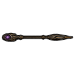

# Bâton Ma'Tok

> Statut : Prototype
> Version d'introduction : 0.1.64-dev

## Présentation

Le bâton Ma'Tok est l'arme emblématique des guerriers Jaffa au service des
Goa'uld. Il associe une longue hampe utilisable au corps à corps à une
décharge énergétique puissante.

```text
bâton Ma'Tok
```

## Visuels validés

| Bâton Ma'Tok | Projectile énergétique |
|---|---|
|  |  |

Depuis `0.3.102-dev`, l'arme et son projectile utilisent deux PNG transparents
dédiés. Le projectile conserve la vitesse validée `80`.

## Fonctionnement actuel

Ce premier prototype est jouable :

- arme à distance à tir unique ;
- dégâts thermiques principaux ;
- impact structurel réduit contre les cibles non organiques ;
- impact structurel réduit contre les bâtiments et tourelles ;
- aucune explosion de zone ;
- cadence volontairement lente ;
- portée intermédiaire ;
- capacités de mêlée avec la hampe et l'extrémité ;
- fabrication au banc d'usinage après la recherche `Armement Jaffa` ;
- visuels non directionnels dédiés et finalisés pour l'arme et son projectile ;
- vitesse du projectile validée à 80.

## Fabrication

```text
60 acier
20 plastacier
2 composants
niveau 6 en Fabrication
banc d'usinage
recherche Armement Jaffa
```

## Impact plasma

Depuis `0.1.76-dev`, le projectile conserve ses dégâts thermiques principaux
contre les êtres biologiques et ajoute une détérioration contondante réduite
contre les cibles non organiques et les bâtiments. Le bâton reste donc utile
face aux mécanoïdes vanilla sans devenir une arme spécialisée anti-machine.

Cette adaptation ne préjuge pas du comportement des futurs Réplicateurs
Stargate : leur résistance particulière aux technologies Goa'uld et Tok'ra
sera ajoutée séparément.

## Limites du prototype

Depuis `0.3.102-dev`, le visuel non directionnel de l'arme et celui de son
projectile sont finalisés. Les guerriers Jaffa Goa'uld générés reçoivent
automatiquement cette arme grâce au système vanilla de loadout. Les gardes
peuvent recevoir soit un Ma'Tok, soit un Zat'nik'tel, ce qui permet de récupérer
les deux armes comme butin.

Le comportement particulier des futurs Réplicateurs reste un développement
séparé.