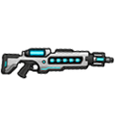
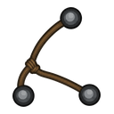
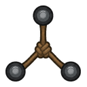
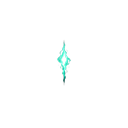

# Outils de capture non létaux

La version `0.3.36-dev` prépare les missions demandant une cible vivante. La version `0.3.37-dev` valide leur première intégration opérationnelle.

## Visuel final du fusil

Depuis `0.3.97-dev`, le fusil utilise un sprite horizontal simplifié et
fortement contrasté. Les modules cyan rappellent ses charges scellées, tandis
que le canon conventionnel évite l'apparence d'une grande aiguille. La petite
variation de pose au sol est le comportement normal hérité des armes RimWorld.

## Bolas

| Bolas | Projectile |
|---|---|
|  |  |
Les bolas sont une solution simple accessible tôt :

- fabrication au point d'artisanat ou dans une forge vanilla ;
- coût de `15` tissus et `8` aciers ;
- arme réutilisable, sans charge consommable ;
- impact contondant léger de `3` dégâts ;
- neutralisation résistible ;
- effet de santé affiché comme une `entrave temporaire par bolas`, avec les jambes entravées.

## Fusil hypodermique expérimental Tok'ra

Le fusil est un dispositif Tok'ra spécialisé, pas une arme humaine classique :

- cinq charges dans la version publiée `0.3.36-dev`, portées à douze dans la version publiée `0.3.37-dev` ;
- une charge consommée par tir, même si le projectile manque ou si la cible résiste ;
- aucune recharge ni fabrication normale ;
- disparition après consommation de la dernière charge ;
- impact contondant minime de `1` dégât ;
- neutralisation plus fiable que les bolas, mais jamais garantie ;
- charges restantes visibles au sol, lorsque l'arme est équipée et lorsqu'elle est transportée dans l'inventaire.

La mission de capture d'un officier Jaffa fournit un seul fusil scellé. Il est déposé en priorité à la zone de livraison Tok'ra configurée, avec les replis habituels du système de livraison si aucune zone valide n'existe.

### Projectile énergétique Tok'ra

Le projectile représente une impulsion extraterrestre de neutralisation plutôt
qu'une seringue physique. Depuis `0.3.102-dev`, le fusil utilise également le
rapport énergétique `Shot_ChargeRifle`.

## Effets de neutralisation

Une fléchette Tok'ra réussie applique une inhibition neuromusculaire temporaire. Les bolas appliquent à la place une entrave physique autour des jambes. Les deux effets laissent la Conscience intacte mais retirent temporairement la capacité de Mouvement.

La cible tombe au sol par le système de santé ordinaire de RimWorld et devient capturable avec l'ordre vanilla. Aucun ordre de maîtrise spécifique au mod n'est nécessaire.

Lors de la mission d'officier Jaffa, une seconde entrave propre au transfert est appliquée dès qu'un colon commence à porter la cible. Elle représente le ligotage réalisé pendant l'extraction du site et le trajet en caravane. L'entrave est retirée sur la colonie pour rendre la main à la détention vanilla, puis réappliquée lorsque l'équipe Tok'ra appelée au communicateur arrive pour prendre physiquement le prisonnier en charge.

Les faibles dégâts restent réels : une cible déjà très gravement blessée n'est jamais totalement à l'abri.

## État du développement

Le flux complet de capture et de remise Tok'ra reste validé. Depuis
`0.3.102-dev`, les bolas sont réutilisables et les trois surfaces
non directionnelles de ce système sont finalisées : bolas, projectile des bolas
et projectile énergétique Tok'ra. Le fusil conserve ses douze charges scellées
et disparaît après la dernière.