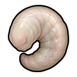
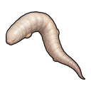

# Larve de Prim'ta

> Statut : Fonctionnel, visuels finaux  
> Version d'introduction : 0.1.27-dev

## Présentation

La larve de Prim'ta est un symbiote Goa'uld immature transportable. Elle sert
d'ingrédient physique à l'opération d'implantation destinée aux Jaffa.

## Objet

```text
larve de Prim'ta
```

## Propriétés actuelles

| Élément | Valeur |
|---|---:|
| Type | Ressource transportable |
| Limite de pile | `10` |
| Masse | `0,1` |
| Valeur marchande | `35` |
| Obtention jouable | [Reine Goa'uld](Goauld-Queen), puis [bassin d'incubation](Primta-Incubation) |
| Obtention pour les tests | Mode développeur toujours disponible |

## Références visuelles finales

| Stade | Visuel | Lecture |
|---|---|---|
| Symbiote immature |  | Petit organisme pâle, compact et recourbé, extrait d'une reine avant incubation |
| Larve de Prim'ta |  | Forme plus longue et développée, prête à la conservation ou à l'implantation |

Les deux ressources utilisent depuis `0.3.96-dev` des familles visuelles
distinctes. Leur aspect ivoire rosé s'inspire d'un stade larvaire souple et peu
cuirassé, sans reprendre la tête osseuse ni les grandes structures d'un
symbiote Goa'uld adulte.

## Utilisation

L'opération :

```text
implanter un Prim'ta jaffa
```

demande désormais :

```text
1 larve de Prim'ta
1 médicament
```

La larve est transportée jusqu'au patient puis consommée par l'opération.

## Évolutions prévues

- infrastructure spécialisée pour les reines ;
- intégration aux factions, quêtes et échanges ;
- maturation en symbiote adulte.

## Bassin d'incubation


Depuis `0.1.28-dev`, construis un
[bassin d'incubation du Prim'ta](Primta-Incubation), puis ajoute la tâche :

```text
incuber une larve de Prim'ta
```

Depuis `0.1.58-dev`, le bassin exige aussi un symbiote immature issu d'une
reine Goa'uld.

## Nutriments d'incubation

Le [bassin d'incubation](Primta-Incubation) consomme :

```text
1 symbiote immature de Prim'ta
10 unités de viande crue
```

pour produire une larve.

## Conservation


Depuis `0.1.30-dev`, les larves de Prim'ta sont périssables.

```text
stockage chaud
    ↓
détérioration progressive
    ↓
larve détruite si elle pourrit complètement
```

Un stockage froid est recommandé avant l'implantation. Le
[bassin de conservation](Primta-Preservation-Basin) suspend l'aggravation tant
qu'il reste alimenté, sans réparer les dommages déjà subis.

## Catégorie de stockage

Depuis `0.1.31-dev`, les larves ne sont plus classées dans les produits
manufacturés.

Elles apparaissent dans :

```text
ressources brutes
    ↓
produits biologiques Goa'uld
```

Cette catégorie est volontairement distincte des aliments crus.

## Température détaillée

Depuis `0.1.32-dev`, consulte [Température des larves](Primta-Temperature).

Le stockage chaud accélère désormais la détérioration :

```text
25 °C et plus  → ×2
40 °C et plus  → ×3
```

La congélation interrompt provisoirement la détérioration, mais une exposition
prolongée sous `-15 °C` hors bassin actif provoque des dommages spécifiques.
