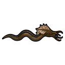
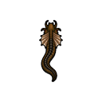
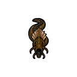

# Symbiotes

> Statut : fondation jouable
> Première fondation : `0.1.7-dev`
> Rendu mobile adulte finalisé : `0.3.104-dev`

## Vue d'ensemble

Les symbiotes sont une mécanique centrale de GateRim SG-1.

| Type | Hôte | Relation |
|---|---|---|
| Goa'uld adulte | humain, Jaffa ou futur Unas compatible | prise de contrôle forcée |
| Tok'ra adulte | hôte volontaire | coexistence et partage du contrôle |
| Prim'ta immature | Jaffa | soutien biologique sans possession |

## Rendu mobile des adultes

Les symbiotes adultes Goa'uld et Tok'ra utilisent la même anatomie et partagent
donc une famille directionnelle commune. Leurs comportements et identités
restent distincts.

| Orientation | Visuel validé |
|---|---|
| Est |  |
| Nord |  |
| Sud |  |

La vue ouest est le miroir de la vue est. Le rendu conserve une posture rampante,
un corps brun-olive luisant, une crête dorsale sombre, une membrane claire,
des yeux rouges, quatre appendices buccaux et un contour noir lisible. Les trois
fichiers sont transparents en `128×128` et utilisent `drawSize = 0.65`.

La reine Goa'uld reste une forme reproductrice distincte et conserve
provisoirement son ancien visuel. Elle recevra une famille séparée.

## Cycle Goa'uld actuel

```text
symbiote libre
    ↓ chasse autonome, commande de test ou rituel
implantation Goa'uld récente
    ↓ période critique
hôte Goa'uld actif
```

Pendant la phase récente, une extraction instantanée de test ou une chirurgie
planifiable peut faire réapparaître le même symbiote avec son identité
persistante.

En jeu normal, sélectionner un symbiote hostile ne donne aucun contrôle direct
sur son implantation ou sa chasse. Les commandes déterministes
`Implantation forcée` et `Chasse autonome` sont réservées au mode développeur.
Un rite n'est accessible qu'à un symbiote réellement contrôlé par le joueur,
tandis qu'une offre Tok'ra explicite conserve ses interactions volontaires.

Les fonctions actuellement disponibles comprennent :

- chasse autonome d'un humanoïde compatible ;
- implantation forcée au contact ;
- implantation rituelle temporisée avec cible choisie ;
- bassin rituel requis ;
- conversion automatique en hôte Goa'uld actif ;
- extraction d'urgence pendant la phase critique ;
- chirurgie d'extraction avec risque d'échec.

## Symbiotes Tok'ra

Un symbiote Tok'ra libre peut être généré pour les tests et utiliser une
implantation volontaire sur un hôte contrôlé par le joueur.

Les hôtes Tok'ra sont également utilisés par les visiteurs, planques,
opportunités thérapeutiques, livraisons et opérations organiques. Contrairement
au Goa'uld libre, le symbiote Tok'ra ne chasse pas de cible contre sa volonté.

## Prim'ta jaffa

Le Prim'ta est séparé de la lignée génétique Jaffa. Il peut être implanté par
chirurgie ou cérémonie, améliore plusieurs capacités biologiques et répond à
des systèmes d'âge, de dépendance pubertaire, de trétonine, d'incubation et de
conservation.

## Développements encore prévus

- transfert direct d'un symbiote adulte entre deux hôtes sans extraction et
  réimplantation intermédiaires ;
- règles biologiques propres aux Unas ;
- approfondissement des relations entre personnalité de l'hôte et symbiote ;
- rendu directionnel distinct pour la reine Goa'uld.
