# Références visuelles validées

> Version de référence : `0.3.95-dev`
> Statut : objets de mission Tok'ra validés en jeu dans `0.3.95-dev`

Cette page rassemble les références visuelles explicitement acceptées. Une copie
placée sous `docs/wiki/images/` doit rester byte-identique au PNG utilisé par le
jeu. Un visuel fonctionnel n'est pas automatiquement définitif : son passage à
`final` exige toujours une validation explicite.

## Identité publique du mod

| Usage | Chemin | Statut |
|---|---|---|
| Icône publique GateRim SG-1 | `About/ModIcon.png` | Final ; conserver l'image personnelle démon rouge/noir et ne pas la réutiliser comme art de gameplay |

## Objets de mission Tok'ra validés

| Visuel | Objet | Def | Chemin sous `Textures/` | Référence validée |
|---|---|---|---|---|
| 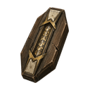 | Module de chiffrement Tok'ra | `SG1_TokraIntroductionArtifact` | `Things/Item/SG1_TokraIntroductionArtifact` | Module scellé bronze sombre et or, matrice cristalline dorée |
| 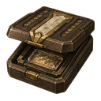 | Paquet de renseignements codés Tok'ra | `SG1_TokraMissionIntelPacket` | `Things/Item/SG1_TokraMissionIntelPacket` | Coffret Tok'ra ouvert contenant un support de données cristallin |
|  | Dispositif d'observation portable et point déployé | `SG1_TokraObservationDevice`, `SG1_TokraObservationPoint` | `Things/Item/SG1_TokraObservationDevice` | Même famille finale volontairement utilisée par l'objet portable et le point installé |
| 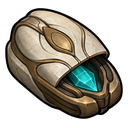 | Cache organique Tok'ra | `SG1_TokraOrganicDeadDrop` | `Things/Item/SG1_TokraOrganicDeadDrop` | Capsule ivoire et bronze entrouverte avec cristal cyan ; catégorie `Item` conservée |
| 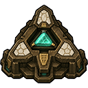 | Nœud de contrôle du relais Goa'uld | `SG1_TokraRelaySabotageDevice` | `Things/Building/SG1_TokraRelaySabotageDevice` | Relique technologique triangulaire bronze vue du dessus |
| 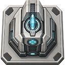 | Communicateur sécurisé Tok'ra | `SG1_TokraSecureCommunicator` | `Things/Building/SG1_TokraSecureCommunicator` | Station fixe argentée et gris froid avec cristal central cyan |
|  | Marquage prioritaire de livraison | `SG1_TokraDeliveryDropSpot` | `Things/Building/TokraDeliveryDropSpot/TokraDeliveryDropSpot` | Marquage au sol épais, contour noir façon RimWorld et légère transparence |

Le point d'observation ne possède plus de famille dédiée obsolète. Toutes les
familles de sites sous `Textures/World/WorldObjects/Expanding/Sites` sont
également considérées comme finales et déjà validées.

## Dispositifs de main Goa'uld validés

| Visuel | Équipement | Def | Chemin sous `Textures/` | Référence validée |
|---|---|---|---|---|
|  | Kara kesh des Grands Maîtres | `SG1_KaraKesh` | `Things/Pawn/Humanlike/Apparel/KaraKesh/KaraKesh` | Gant articulé bronze et or, sangles de cuir et gemme de contrôle rouge ; PNG transparent `128×128` validé au sol, dans l'inventaire et équipé |
| 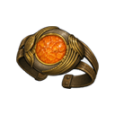 | Bracelet de guérison Goa'uld | `SG1_GoauldHealingBracelet` | `Things/Pawn/Humanlike/Apparel/GoauldHealingBracelet/GoauldHealingBracelet` | Bracelet circulaire or et argent autour d'un noyau orange lumineux ; PNG transparent `128×128` validé au sol, dans l'inventaire et équipé |

Les deux Defs restent des apparel et conservent donc leurs chemins historiques
sous `Things/Pawn/Humanlike/Apparel`. Ce jalon remplace uniquement les images
d'objet ; il n'ajoute aucun rendu directionnel porté ni changement de gameplay.

## Bâtiments Goa'uld et Prim'ta validés

| Visuel | Bâtiment | Def | Chemin sous `Textures/` | Référence validée |
|---|---|---|---|---|
| 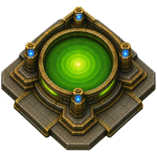 | Bassin rituel Goa'uld `2×2` ou `3×3` | `SG1_GoauldRitualBasin`, `SG1_GoauldRitualBasinLarge` | `Things/Building/SG1_GoauldRitualBasin` | Plateforme cérémonielle Goa'uld dorée et sombre, bassin central vert et quatre pylônes bleus ; même rendu visuel `2×2` et même icône pour les deux empreintes |
| 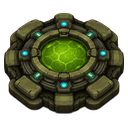 | Bassin d'incubation du Prim'ta | `SG1_PrimtaIncubationBasin` | `Things/Building/SG1_PrimtaIncubationBasin` | Dispositif biologique vert sur une case ; image fixe tandis que l'orientation conserve la cellule d'interaction |
| 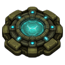 | Bassin de conservation du Prim'ta | `SG1_PrimtaPreservationBasin` | `Things/Building/SG1_PrimtaPreservationBasin` | Stockage biologique bleu sur une case, sans coloration de matériau ni ombre héritée |

Le `defName` historique du bassin rituel reste attribué à la variante `2×2` afin
de préserver les sauvegardes existantes. La variante `3×3` change uniquement
l'empreinte de placement : elle ne grossit pas l'image centrale.

## Portraits de storyteller validés

| Portrait | Storyteller | Def | Chemins sous `Textures/` | Référence visuelle |
|---|---|---|---|---|
| 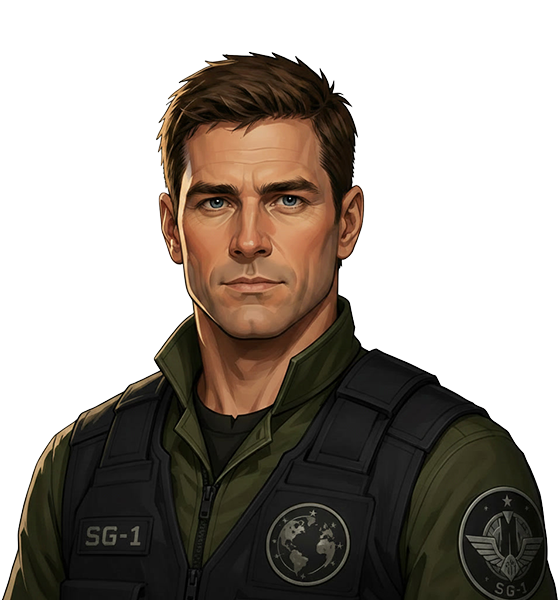 | Commandement SG-1 | `SG1_GateRimStoryteller` | `Storytellers/SG1_Command`, `Storytellers/SG1_Command_Tiny` | Grand portrait transparent `560×600` et recadrage tiny dédié `122×130`, fournis par le mainteneur puis validés dans l'interface réelle |

## Icônes de xénotypes validées

| Icône | Xénotype | Def | Chemin sous `Textures/` | Référence visuelle |
|---|---|---|---|---|
|  | Jaffa | `SG1_Jaffa` | `UI/Xenotypes/SG1_Jaffa` | Tête humaine blanche très épurée portant la marque d'Apophis |
|  | Hôte Goa'uld | `SG1_GoauldHost` | `UI/Xenotypes/SG1_GoauldHost` | Symbiote Goa'uld blanc simplifié qui représente l'état acquis |

## Icônes de gènes validées

| Icône | Gène | Chemin sous `Textures/` | Lecture visuelle |
|---|---|---|---|
|  | `SG1_JaffaLineage` | `UI/Genes/SG1_JaffaLineage` | Visage Jaffa adulte et descendant marqué, pour la transmission de la lignée |
|  | `SG1_JaffaPhysiology` | `UI/Genes/SG1_JaffaPhysiology` | Caisse et flèche ascendante verte pour le bonus de capacité de transport |
|  | `SG1_JaffaPouchPotential` | `UI/Genes/SG1_JaffaPouchPotential` | Corps vanilla simplifié avec deux incisions abdominales croisées à 45 degrés |
| 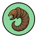 | `SG1_JaffaSymbioteCompatibility` | `UI/Genes/SG1_JaffaSymbioteCompatibility` | Larve Goa'uld brune, collerette et quatre dents, dans un cercle vert de compatibilité |
|  | `SG1_GoauldLongevity` | `UI/Genes/SG1_GoauldLongevity` | Sablier entouré de deux flèches cycliques |
|  | `SG1_NaquadahBlood` | `UI/Genes/SG1_NaquadahBlood` | Goutte de sang rouge avec reflet vert fluorescent rappelant une fiole de naquadah |

Le prototype obsolète `SG1_JaffaLongevity` n'est plus utilisé : son `GeneDef`,
sa traduction et son PNG dédié ont été supprimés en `0.3.89-dev`. La longévité
des Jaffa reste fournie par l'état de santé du Prim'ta. Les trois anciens gènes
techniques de marques frontales sont également supprimés en `0.3.90-dev`; les
marques réellement utilisées restent des données intrinsèques du pion.

## Marques frontales Jaffa intrinsèques validées

| Marque visible | Rang | Def intrinsèque | Famille sous `Textures/` | Rendu |
|---|---|---|---|---|
| 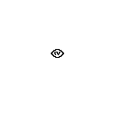 | Jaffa ordinaire | `SG1_JaffaForeheadMark_GenericIntrinsic` | `Things/Pawn/Humanlike/JaffaForeheadMarks/GenericJaffaForeheadMark` | Petit symbole d'Apophis noir, visible uniquement en `South` |
|  | Élite sélectionnée | `SG1_JaffaForeheadMark_GenericSilverIntrinsic` | `Things/Pawn/Humanlike/JaffaForeheadMarks/GenericSilverJaffaForeheadMark` | Même géométrie argentée, visible uniquement en `South` |
|  | Premier Primat | `SG1_JaffaForeheadMark_GenericGoldIntrinsic` | `Things/Pawn/Humanlike/JaffaForeheadMarks/GenericGoldJaffaForeheadMark` | Même géométrie dorée, visible uniquement en `South` |

Chaque famille conserve quatre PNG `128×128`. Les fichiers `North`, `East` et
`West` sont entièrement transparents afin que la marque reste un tatouage
strictement frontal, sans texture flottante sur les autres orientations.

## Icônes de commandes Goa'uld et Jaffa validées

| Icône | Commande ou famille | Chemin sous `Textures/` | Lecture visuelle |
|---|---|---|---|
| 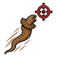 | Chasse autonome du symbiote | `UI/Commands/SG1_AutonomousHunt` | Symbiote brun en mouvement vers un réticule rouge |
|  | Extraction instantanée développeur | `UI/Commands/SG1_EmergencyExtraction` | Symbiote séparé d'un hôte allongé sous une lampe chirurgicale |
| 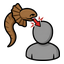 | Implantation forcée adjacente | `UI/Commands/SG1_ForcedImplantation` | Symbiote frappant vers un hôte par une courte flèche rouge |
|  | Famille d'implantation et de cérémonie partagée | `UI/Commands/SG1_RitualImplantation` | Symbiote et hôte devant un sceau rituel doré |

Les quatre PNG sont transparents et conservent leur format gameplay `64×64`.
La famille rituelle reste partagée par les surfaces Goa'uld, Tok'ra et la
cérémonie formelle du Prim'ta, sans changement de logique.

## Icônes de factions mondiales validées

| Icône | Faction | Def principal | Chemin sous `Textures/` |
|---|---|---|---|
|  | Jaffa libres | `SG1_FreeJaffa` | `World/WorldObjects/Expanding/SG1_FreeJaffa` |
|  | Domaines des Grands Maîtres Goa'uld | `SG1_GoauldSystemLordPrototype` | `World/WorldObjects/Expanding/SG1_GoauldSystemLords` |
|  | Expédition SGC | `SG1_PlayerSGCExpedition` | `World/WorldObjects/Expanding/SG1_SGCExpedition` |
|  | Tok'ra | `SG1_Tokra` | `World/WorldObjects/Expanding/SG1_Tokra` |

## Icônes de sites d'événements validées

| Icône | Événement ou site | Def ou usage principal | Chemin sous `Textures/` |
|---|---|---|---|
|  | Objectif Goa'uld chiffré | `SG1_TokraIntroductionArtifactWorldSite` | `World/WorldObjects/Expanding/Sites/SG1_GoauldEncryptedObjective` |
|  | Champ de bataille Goa'uld | `SG1_GoauldOpenConflictBattlefieldSite` | `World/WorldObjects/Expanding/Sites/SG1_GoauldOpenConflictBattlefield` |
|  | Relais Goa'uld à saboter | `SG1_TokraDecodedMissionWorldSite` | `World/WorldObjects/Expanding/Sites/SG1_GoauldRelaySabotage` |
|  | Position de l'officier Jaffa | `SG1_TokraJaffaOfficerCaptureSite` | `World/WorldObjects/Expanding/Sites/SG1_JaffaOfficerFieldPosition` |
|  | Contact clandestin Tok'ra | `SG1_TokraHiddenSafehouseMarker`, `SG1_TokraHiddenSafehouseSitePart` | `World/WorldObjects/Expanding/Sites/SG1_TokraClandestineContact` |
|  | Signal de détresse Tok'ra | `SG1_TokraDistressCallWorldSite` | `World/WorldObjects/Expanding/Sites/SG1_TokraDistressSignal` |
|  | Rendez-vous logistique Tok'ra | `SG1_TokraTemporaryBaseDeliverySite` | `World/WorldObjects/Expanding/Sites/SG1_TokraLogisticsRendezvous` |

## Visuels encore temporaires

Les autres visuels locaux restent temporaires, notamment les armes, les autres
équipements et vêtements, les projectiles et les pawns.
Les objets de mission Tok'ra présentés ci-dessus, les deux dispositifs de main,
les bâtiments validés, les trois familles de marques frontales intrinsèques et
les quatre commandes sont désormais finals.

Le détail technique, les priorités et les nombres de fichiers restent maintenus
dans `docs/VISUAL_ASSET_REGISTER.md` du dépôt principal.
