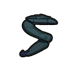

# Zat'nik'tel

> Statut : Prototype jouable  
> Première version : 0.1.77-dev
> Acquisition naturelle rare : 0.2.9-dev

## Présentation

Le **Zat'nik'tel** est une arme de poing énergétique compacte Goa'uld conçue
pour neutraliser ses cibles.

Le premier prototype jouable se concentre uniquement sur le rôle non létal du
premier tir.

## Visuels validés

| Zat'nik'tel | Décharge énergétique |
|---|---|
|  |  |

Depuis `0.3.102-dev`, l'arme compacte et sa décharge utilisent deux visuels
transparents dédiés, lisibles au sol, dans l'inventaire et pendant le tir.

## Effet actuel

```text
cible directe          -> étourdissement temporaire
cible non organique     -> faible perturbation IEM supplémentaire
bâtiment ou tourelle   -> faible perturbation IEM supplémentaire
```

Une cible biologique ne reçoit pas de blessure physique supplémentaire. Le
Zat ne provoque pas d'explosion de zone et n'est pas conçu pour démolir les
structures.

## Fabrication

Le prototype peut être fabriqué au banc d'usinage après la recherche
**Armement Jaffa**.

## Acquisition naturelle

Les gardes Jaffa au service des Goa'uld peuvent désormais apparaître avec un
Ma'Tok ou un Zat'nik'tel. Comme les gardes sont moins fréquents que les
guerriers ordinaires, le Zat reste une récupération rare lors des raids
naturels ou de l'exploration des colonies Goa'uld.

Une arme récupérée reste utilisable avant la recherche **Armement Jaffa** ; la
recherche verrouille uniquement sa fabrication locale.

## Limites du prototype

Ne sont pas encore implémentés :

- le deuxième tir létal ;
- le troisième tir désintégrant ;
- la mémorisation temporaire du nombre de tirs reçus ;
- l'attribution à d'autres profils Jaffa que les gardes Goa'uld ;
- l'animation complexe d'ouverture de l'arme ;
- les résistances futures des Réplicateurs et des guerriers Kull.

Le comportement mécanique final sera affiné après les premiers tests
d'équilibrage.
